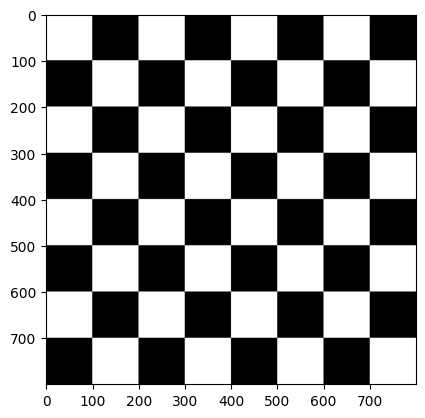
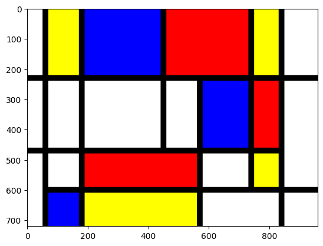
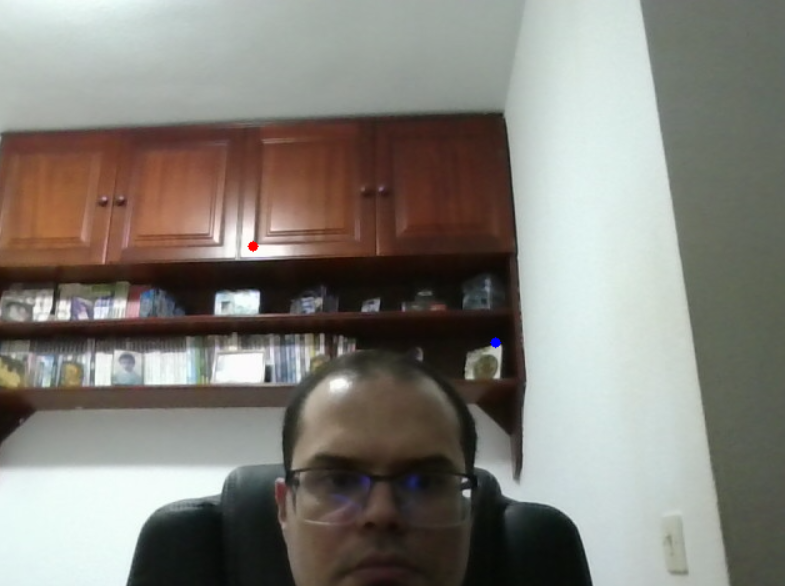
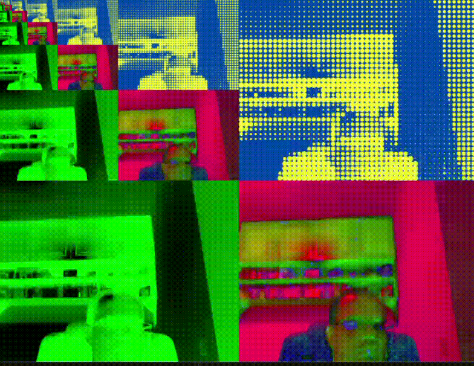

# Visión por Computador - Práctica 1

Esta práctica ha consistido en realizar una serie de tareas con el objetivo de adquirir la capacidad de utilizar OpenCV para crear una imagen de un determinado tamaño, acceder a los valores asociados a un determinado píxel, modificar dichos valores, dibujar primitivas gráficas básicas sobre una imagen, abrir una imagen de disco, así como acceder a los fotogramas de un vídeo o captura de cámara.

## TAREA 1: Crear una imagen con la textura de un tablero de ajedrez
Para realizar esta tarea se ha inicializado la imagen en negro y dividiéndola en 8x8 segmentos, se rellenó en blanco los segmentos impares de las filas impares y los segmentos pares de las filas pares.

## TAREA 2: Hacer uso de las funciones de dibujo de OpenCV para crear una imagen estilo Mondrian
Para realizar esta tarea se ha inicializado la imagen en negro y se rellenó con varios rectángulos de diferentes colores en distintas posiciones, de manera que los huecos negros hacen de líneas.

## TAREA 3: Destacar tanto el píxel con el color más claro como con el color más oscuro de una imagen
Para realizar esta tarea, se ha determinado el brillo de los píxeles convirtiendo el frame a escala de grises y aplicando la función de OpenCV "minMaxLoc"[^2], que proporciona las posiciones de los píxeles de menor y mayor valor. El círculo de color rojo corresponde al más claro y el azul al más oscuro.

## TAREA 4: Llevar a cabo una propuesta propia de pop art
Para realizar esta tarea, se ha dividido la imagen en cuatro segmentos. En el segmento superior derecho, se ha adaptado la función de la fuente[^3], de manera que reconstruye la imagen como puntos de color amarillo sobre un fondo azul. En el inferior izquierdo, primero se invirtió el color del frame y posteriormente se le aplicó la función de OpenCV "multiply" con una imagen verde para darle dicho color. En el inferior derecho, se cambió el espacio de colores a HSV. En el superior izquierdo, se ha insertado una versión reescalada de la imagen original y se ha repetido este proceso en ese segmento varias veces, creando algo similar al efecto que se produce al colocar un espejo frente a otro.

## Autor
Javier A. Alfonso Quintana

## Fuentes
[^1]: https://stackoverflow.com/questions/40895785/using-opencv-to-overlay-transparent-image-onto-another-image
[^2]: https://docs.opencv.org/4.x/de/da9/tutorial_template_matching.html
[^3]: https://www.analytics-link.com/post/2019/07/11/creating-pop-art-using-opencv-and-python